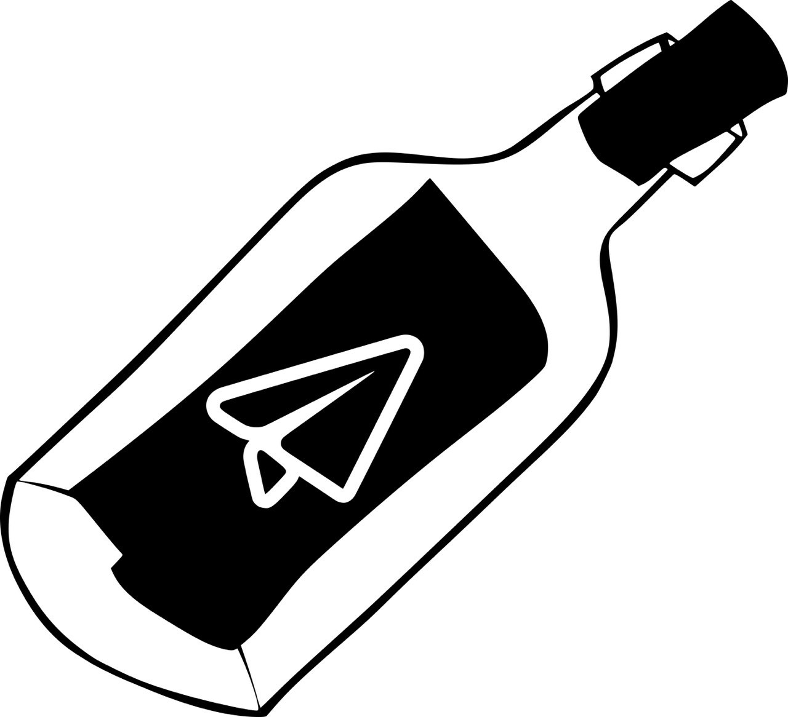

<p align="center">
  
</p>

# Bottlegram

Bottlegram is a tool for creating telegram Bots with Pharo. This library provides an interface for the [Telegram Bot API](https://core.telegram.org/bots/api.).

### Install

```smalltalk
Metacello new
  baseline: #Bottlegram;
  repository: 'github://pablo1n7/bottlegram';
  load.
```

### Basic usage

To create our telegram bot in Pharo, the first thing we need to do is to create a new object that inherits from Bottlegram. 
This object must define at least this three methods:

  * `slashStart`: to be executed when the bot receives `/start`.

  * `slashHelp`: to be executed when the bot receives `/help`.

  * `defaultText`: to be executed when the bot receives an unknown command.

For example:
```smalltalk

Bottlegram subclass: #EchoBottle
	instanceVariableNames: ''
	classVariableNames: ''
	poolDictionaries: ''
	category: 'Bottlegram-Example'!

defaultText: aMessage
	aMessage answer: aMessage text.! !

slashHelp: aMessage
	aMessage send:'Hello, I'm a Telegram bot written in Pharo. Tell me something and I'll repeat after you'! !
                
slashStart: aMessage
	aMessage send:'Hello, I'm a Telegram bot written in Pharo. Send /help for more information'! !
```

#### Defining new behavior

We can define new behavior for our bot by implementing new methods for it. Then we need to associate them to a tag like: `#slashMyNewBehaviour` and the corresponding command for the bot, like `/myNewBehavior`. 
Where `slashMyNewBehaviour` must match with the name of our new method. 

To do this, we will call `registerCommand`. For example:

```smalltalk
 registerCommand: #slashWeather: to: '/weather'.
```
So when the bot receives the message `/weather`, it will call its `slashWeather` method.

### Example using polling

Then, to start the Echo bot that we have created:

```smalltalk

echoBotte:=EchoBottle new:'paste here the API TOKEN obtained from the BotFather'.
echoBotte startBotPulling:1. "Polling updates every second."
echoBotte stopBot. "To stop the bot and the polling process"

```

### Example using Webhook
```smalltalk

echoBotte:=EchoBottle new:'paste here the API TOKEN obtained from the BotFather'.
echoBotte registerWebhook: 'URL' port: 8080.
echoBotte startBot.
echoBotte stopBot. "To stop the bot and the server Webhook"

```

### Example Online: [EchoPharo](https://t.me/echo_pharo_bot)


### TODO: 
* [ ] Add more documentation.
* [ ] Add support for inline bots.
* [ ] Add support for images, sounds, etc.
